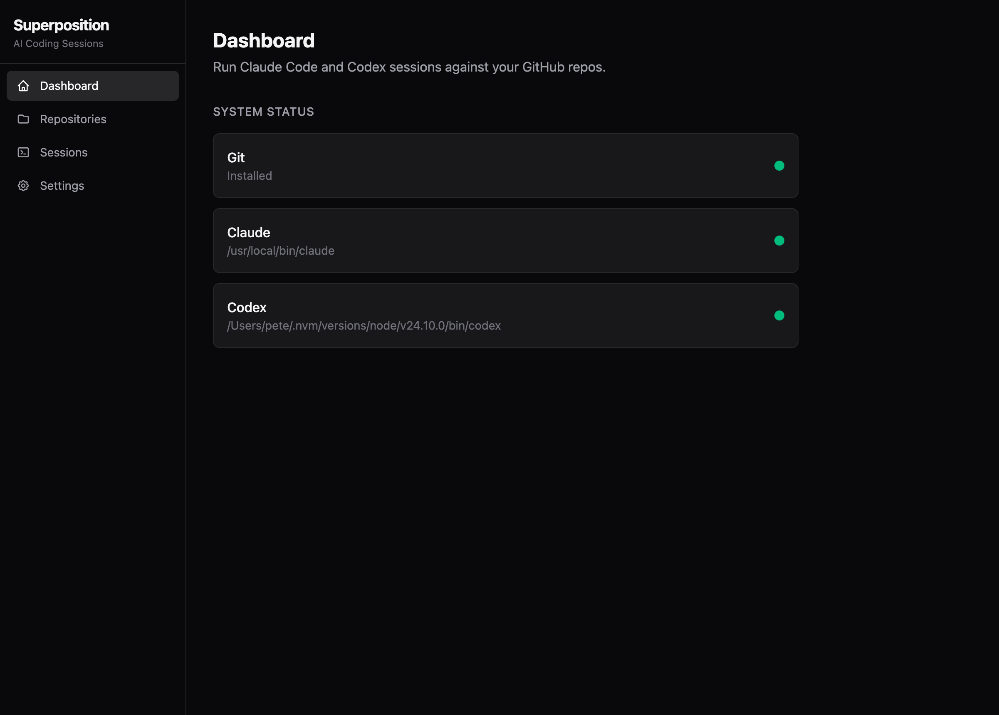
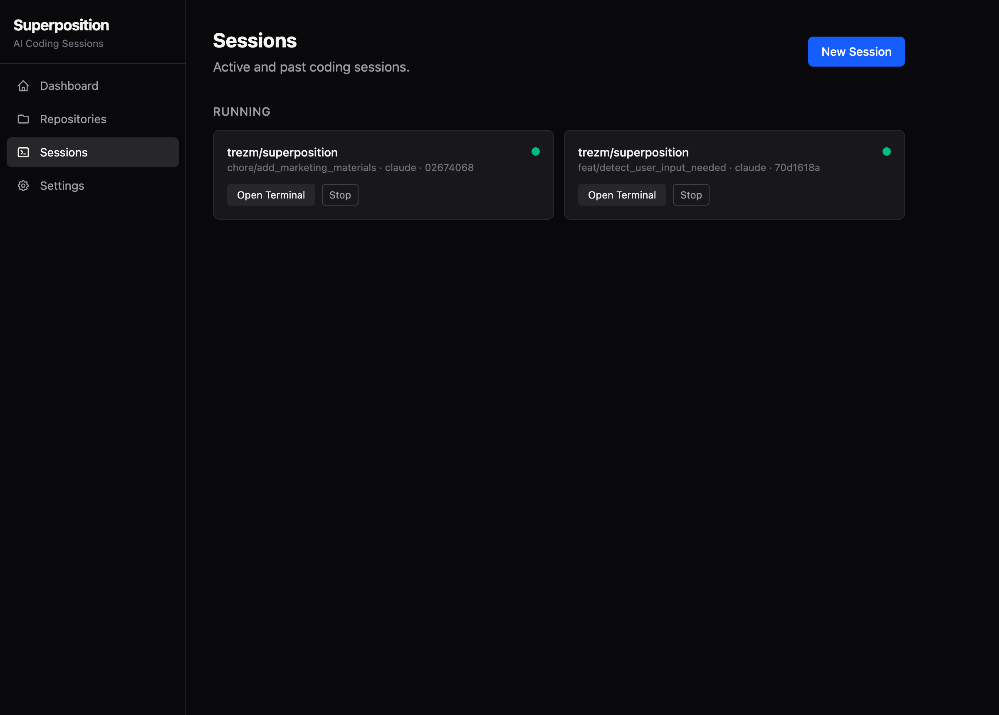
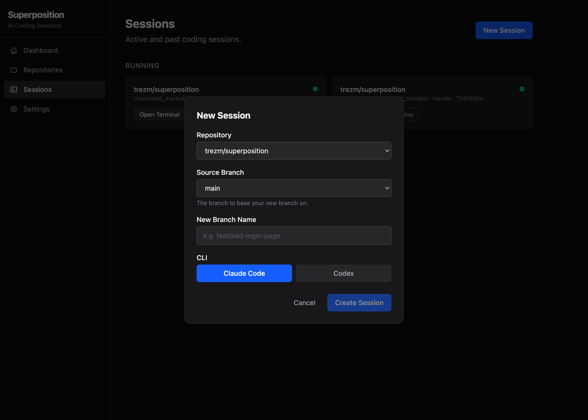
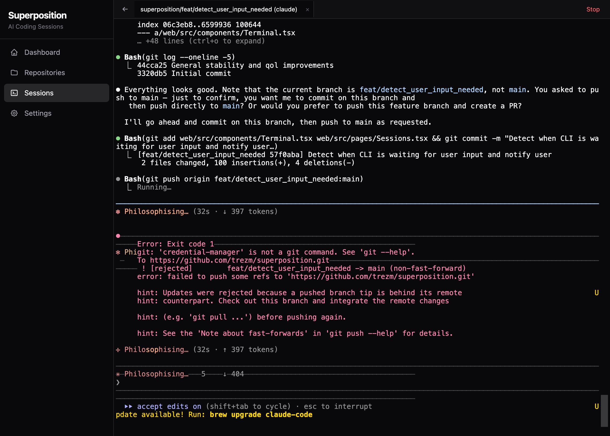
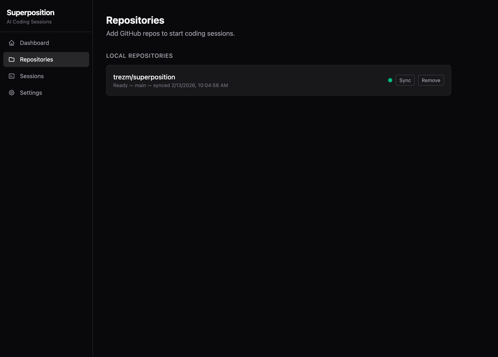
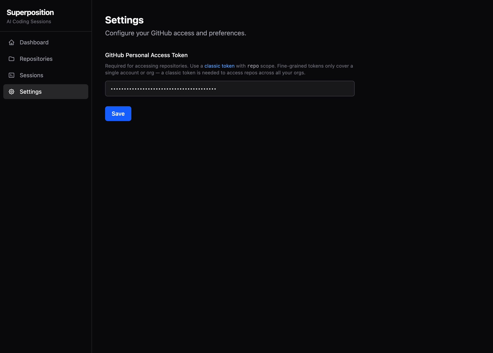

# Superposition

[](https://github.com/trezm/superposition/actions/workflows/go-quality.yml)
[](https://github.com/trezm/superposition/actions/workflows/web-quality.yml)

A web-based application for running AI coding sessions (Claude Code and Codex) against your GitHub repositories. Each session runs in an isolated git worktree with a full browser-based terminal.



## Features

- **Multi-CLI Support** — Run sessions with Claude Code or Codex
- **Branch Isolation** — Each session gets its own git worktree, so parallel sessions never conflict
- **Browser Terminal** — Full xterm.js terminal with automatic reconnection and 100 KB replay buffer, plus virtual keyboard for mobile/touch devices
- **Session Persistence** — A background shepherd process keeps PTY sessions alive across server restarts, so deploys never kill a running session
- **Repository Management** — Clone and sync GitHub repos via Personal Access Token
- **Remote Access Gateway** — Optional reverse-tunnel proxy with TLS and login auth for accessing sessions from anywhere, no inbound ports required
- **Single Binary** — Compiles to a standalone Go binary with the React frontend embedded

## Screenshots

### Sessions

View and manage all running sessions. Each card shows the repo, branch, CLI type, and session ID.



### New Session

Create a session by picking a repo, source branch, new branch name, and CLI.



### Terminal

Interact with Claude Code or Codex directly in the browser.



### Repositories

Add GitHub repos and sync them to keep branches up to date.



### Settings

Configure your GitHub Personal Access Token for repo access.



## Prerequisites

- **Git** — required
- **Go 1.23+** — for building from source
- **Node.js / npm** — for building the frontend
- **Claude Code** and/or **Codex** CLI installed on your `PATH`

## Quick Start

```bash
# Clone the repo
git clone https://github.com/trezm/superposition.git
cd superposition

# Build the binary (compiles frontend + Go backend)
make build

# Run it
./superposition
```

Open [http://127.0.0.1:8800](http://127.0.0.1:8800) in your browser.

> **Note:** The server binds to `0.0.0.0`, so it's accessible from other machines on your network. If you're running on a public server, put it behind a reverse proxy with authentication or limit access via firewall rules.

### First-time setup

1. Go to **Settings** and enter your [GitHub Personal Access Token](https://github.com/settings/tokens) (classic token with `repo` scope)
2. Go to **Repositories** and add a repo from the list
3. Go to **Sessions**, click **New Session**, pick your repo and branch, and start coding

## Development

Run the backend and frontend separately for hot-reload:

```bash
# Terminal 1 — Go backend on :8800
make dev-backend

# Terminal 2 — Vite dev server on :5173 (proxies API to :8800)
make dev-frontend
```

## Production Build

```bash
make build
```

This produces a single `./superposition` binary with the React SPA embedded. No external files needed.

### CLI flags

```
-port int              server port (default 8800)
-gateway string        gateway URL to tunnel through (e.g. wss://gateway.example.com/tunnel)
-gateway-secret string pre-shared secret for gateway authentication
```

Environment variables `SP_GATEWAY_URL` and `SP_GATEWAY_SECRET` can be used instead of flags.

## Remote Access (Gateway Mode)

The gateway is a reverse-tunnel proxy that lets you access your local Superposition instance from anywhere — useful for accessing sessions from a phone, tablet, or another machine.

The gateway runs as a separate TLS server (self-signed by default) with username/password authentication. Your local Superposition connects outbound to it, so no inbound ports or firewall changes are needed on your dev machine.

### 1. Start the gateway on a public server

```bash
SP_USERNAME=admin SP_PASSWORD=changeme ./superposition gateway
```

The gateway listens on port 443 by default and prints a tunnel URL and auto-generated secret:

```
Listening on https://0.0.0.0:443
Tunnel secret: <generated>

Connect superposition with:
  superposition --gateway wss://YOUR_HOST/tunnel --gateway-secret <secret>
```

#### Gateway flags

| Flag | Env var | Default | Description |
|------|---------|---------|-------------|
| `--port` | — | `443` | HTTPS listen port |
| `--tls-cert` | — | — | Path to TLS certificate (auto-generates self-signed if omitted) |
| `--tls-key` | — | — | Path to TLS private key |
| — | `SP_USERNAME` | *(required)* | Login username |
| — | `SP_PASSWORD` | *(required)* | Login password |
| — | `SP_GATEWAY_SECRET` | *(auto-generated)* | Pre-shared secret for tunnel auth |

### 2. Connect your local instance

```bash
./superposition --gateway wss://your-server.com/tunnel --gateway-secret <secret>
```

This opens an outbound WebSocket to the gateway. All HTTP and WebSocket traffic is multiplexed through the tunnel via [yamux](https://github.com/hashicorp/yamux), so the UI, API, and terminal sessions all work remotely.

### 3. Open the gateway in your browser

Navigate to `https://your-server.com` and log in with the username and password you configured. The gateway proxies everything to your local instance — you get the full Superposition UI with live terminal access.

## Architecture

```
├── main.go                  # Entry point, server bootstrap
├── migrations/              # SQLite schema
├── internal/
│   ├── api/                 # REST handlers (repos, sessions, settings)
│   ├── db/                  # Database helpers
│   ├── git/                 # Git operations (clone, worktree, fetch)
│   ├── github/              # GitHub API client
│   ├── models/              # Data models
│   ├── pty/                 # PTY process management
│   ├── preflight/           # CLI dependency checks
│   ├── server/              # HTTP server + middleware
│   ├── shepherd/            # Long-lived PTY process manager (survives restarts)
│   ├── tunnel/              # Outbound tunnel client (connects to gateway)
│   ├── gateway/             # Remote access gateway (TLS, auth, reverse proxy)
│   └── ws/                  # WebSocket terminal streaming
└── web/                     # React frontend
    └── src/
        ├── components/      # Terminal, Layout, Modal, Toast
        └── pages/           # Dashboard, Repos, Sessions, Settings
```

**Backend:** Go with standard library routing (Go 1.22+), SQLite, gorilla/websocket, creack/pty

**Frontend:** React 19, React Router 7, xterm.js, Tailwind CSS, Vite

**Data:** Stored in `~/.superposition/`:

```
~/.superposition/
├── superposition.db         # SQLite database (settings, repos, sessions)
├── repos/                   # Bare git clones (owner/name.git)
├── worktrees/               # Active session worktrees (one per session)
├── shepherd.sock            # Unix socket for shepherd IPC
└── shepherd.pid             # Shepherd process ID
```

## Troubleshooting

| Problem | Fix |
|---------|-----|
| **Port already in use** | Another instance may be running. Kill it or use `-port <other>`. |
| **Stale shepherd socket** | If sessions won't start after a crash, remove `~/.superposition/shepherd.sock` and restart. |
| **Repos not loading** | Verify your GitHub PAT has `repo` scope and hasn't expired. |
| **Terminal blank on reconnect** | Refresh the page — the replay buffer will restore output. |

## License

[MIT](LICENSE)
